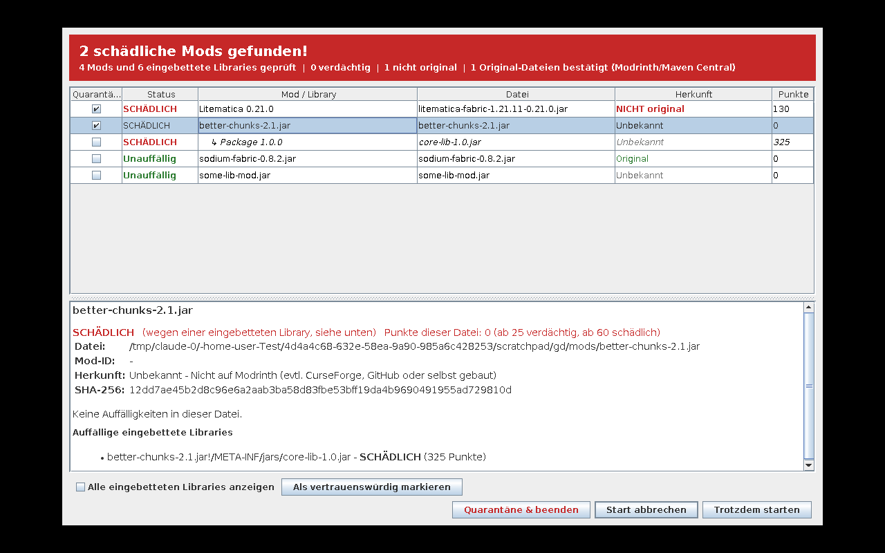

# SilentNet Guard – InjectedMod Assist

Fabric-Mod, die **vor dem Start von Minecraft** alle Mods prüft und dir einen Prüfbericht zeigt.
Du entscheidest dann, ob das Spiel startet, ob es abgebrochen wird oder ob schädliche Mods in Quarantäne kommen.



## Was geprüft wird

Die Mod läuft als `preLaunch`-Entrypoint, also **bevor** die `onInitialize`-Methoden anderer Mods ausgeführt werden.
Alle `.jar`-Dateien im `mods`-Ordner werden **statisch** gelesen: Es wird nichts davon geladen oder ausgeführt.
Eingebettete Libraries (`META-INF/jars/*.jar` und versteckte Archive) werden rekursiv als eigene Einträge geprüft.

### InjectedMod Assist – Herkunft

| Ergebnis | Bedeutung |
|---|---|
| **Original** | Der SHA-512 der Datei gehört zu einer offiziellen Version auf Modrinth. |
| **Bekannte Library** | Eingebettete Library, deren SHA-1 auf Maven Central bekannt ist. |
| **NICHT original** (+25) | Die Mod-ID gibt es auf Modrinth, aber diese Datei gehört zu keiner offiziellen Version. Sie wurde verändert (z. B. infiziert) oder stammt aus einer inoffiziellen Quelle. |
| Unbekannt | Weder auf Modrinth noch auf Maven Central (z. B. nur auf CurseForge oder selbst gebaut). Gibt keine Punkte. |
| Vertrauenswürdig | Von dir freigegeben (Allowlist). |

Online werden nur Datei-Hashes und Mod-IDs gesendet. Bestätigte Originale werden in
`config/silentnet-guard-cache.properties` zwischengespeichert. Ohne Internet läuft alles andere normal weiter.

### Erkennung

Jede Regel zählt pro Datei einmal. Ab **25 Punkten** ist eine Datei *verdächtig*, ab **60** *schädlich*.
Fähigkeiten, die auch normale Libraries haben (Prozess starten, Klassen laden), geben nur wenige Punkte und zählen nur,
wenn sie **in derselben Klasse** zusammen vorkommen.

| Kategorie | Beispiele | Punkte |
|---|---|---|
| Bekannte Malware | SilentNet-Hash und -Tarnung, Fractureiser-Indikatoren und Stage-0-Muster | 40–100 |
| Minecraft-Token-Diebstahl | `Session.getAccessToken`, Reflection auf das Session-Feld, `--accessToken` aus den Startparametern, Account-Dateien von Launchern (Minecraft Launcher, Lunar, Feather, Essential, Prism, MultiMC, TLauncher …), Token + Netzwerk zu Nicht-Mojang-Servern | 10–40 |
| Datendiebstahl | Discord-Token-Speicher, Browser-Passwörter/Cookies, Krypto-Wallets, DPAPI (`CryptUnprotectData`), System-/IP-Infos | 10–50 |
| Datenversand / C2 | Discord-Webhooks, Telegram-Bots, Paste-/Tunnel-/Filehoster, nackte öffentliche IPs, Blockchain-C2 (EtherHiding), DNS-over-HTTPS | 15–50 |
| Fernsteuerung (RAT) | Reverse Shell, Screenshots, Maus/Tastatur, Keylogger, Webcam, Defender-Ausnahmen, Mods im `mods`-Ordner verändern, getarnte EXE/ELF-Dateien | 10–50 |
| Autostart | Registry-Run-Key, `schtasks`, Autostart-Ordner, systemd/LaunchAgents/crontab | 15–40 |
| Eingeschleuster Code | Klassen direkt in `com/github/`, SilentNet-String-Verschlüsselung, Entrypoint auf eingeschleuste Klasse, fremder Entrypoint außerhalb der Mod-Pakete, Klassen/Archive unter falschem Namen | 15–40 |
| Verschleierung | Verschlüsselte Payload-Datei (hohe Entropie), stark verschlüsselte Strings | 15–20 |

Zusätzlich wird das System geprüft: SilentNet-Ordner (`%LOCALAPPDATA%\Microsoft\Windows\NtProfileIndex`),
Fractureiser-Dateien (Windows und Linux), Skripte/JARs im Autostart. Laufende Malware-Prozesse werden beendet.

## Der Prüfbericht

Das Fenster erscheint nur, wenn etwas gefunden wurde (oder `always_show_screen=true`). Es läuft in einem eigenen
Java-Prozess, damit es Minecraft nicht stört.

- **Tabelle:** alle Mods mit Status, Herkunft und Punkten. Auffällige eingebettete Libraries stehen eingerückt darunter.
- **Details:** alle Funde der ausgewählten Datei nach Kategorie, mit Hashes und Herkunft.
- **Trotzdem starten:** Minecraft startet. Bei Malware gibt es vorher eine Sicherheitsabfrage.
- **Start abbrechen:** Minecraft wird beendet.
- **Quarantäne & beenden:** Minecraft wird beendet, danach werden die markierten Mods nach
  `silentnet-quarantine/` verschoben und in `*.jar.disabled` umbenannt. Schädliche Mods sind vorausgewählt.
- **Als vertrauenswürdig markieren:** Die Datei wird künftig nicht mehr gemeldet (`config/silentnet-guard-allow.txt`).

Ohne Bildschirm (Server, headless) gilt: Malware bricht den Start ab, alles andere wird nur ins Log geschrieben.
Der Bericht steht immer auch in `silentnet-guard-report.txt` im Spielordner.

## Einstellungen

`config/silentnet-guard.properties` (wird beim ersten Start angelegt):

```properties
always_show_screen=false            # Bericht vor jedem Start zeigen
online_check=true                   # Herkunft über Modrinth/Maven Central prüfen
show_screen_for_not_original=true   # Fenster auch bei "NICHT original" ohne weitere Funde
```

## Grenzen

- Die Reihenfolge von `preLaunch`-Entrypoints verschiedener Mods ist nicht garantiert. Malware, die selbst `preLaunch`
  nutzt, könnte vor dieser Mod laufen. Die Mod ersetzt keinen Virenscanner.
- Die Erkennung ist heuristisch. Stark verschleierte, neue Malware kann durchrutschen.
- „NICHT original“ kann auch bei Dev-Builds oder bei Mods erscheinen, die auf CurseForge anders hochgeladen wurden.

## Bauen

```
./gradlew build
```

Die fertige Mod liegt danach in `build/libs/silentnet-guard-1.2.0.jar` und kommt in den `mods`-Ordner.

Ohne Minecraft einzelne Dateien prüfen:

```
java -cp silentnet-guard-1.2.0.jar de.lumiwork.silentnetguard.Cli [--online] verdacht.jar ...
```

## Indikatoren (IOCs) des analysierten SilentNet-Samples

- SHA-256: `f47fecd6b5107111e518c2ceec31d07cfca170f69fcd991dc175c78b65a384c0` (`auto-schematic-builder-1.21.11.jar`)
- Domain: `sltnnt.ru`, Pfad `/cdn/v2/9f4e7a2c1b8d.png`
- Polygon-Contract (C2-Adresse): `0x9c0a507300fd902787bb193d80fca5ce6e1bff9a`, Selector `0xce6d41de`
- Ordner: `%LOCALAPPDATA%\Microsoft\Windows\NtProfileIndex` (`_spawn.log`, `.cache_idx`)
- Payload in der JAR: `assets/naytzuea.cache`
- Eingeschleuste Klassen direkt in `com/github/` mit verschlüsselten Strings
